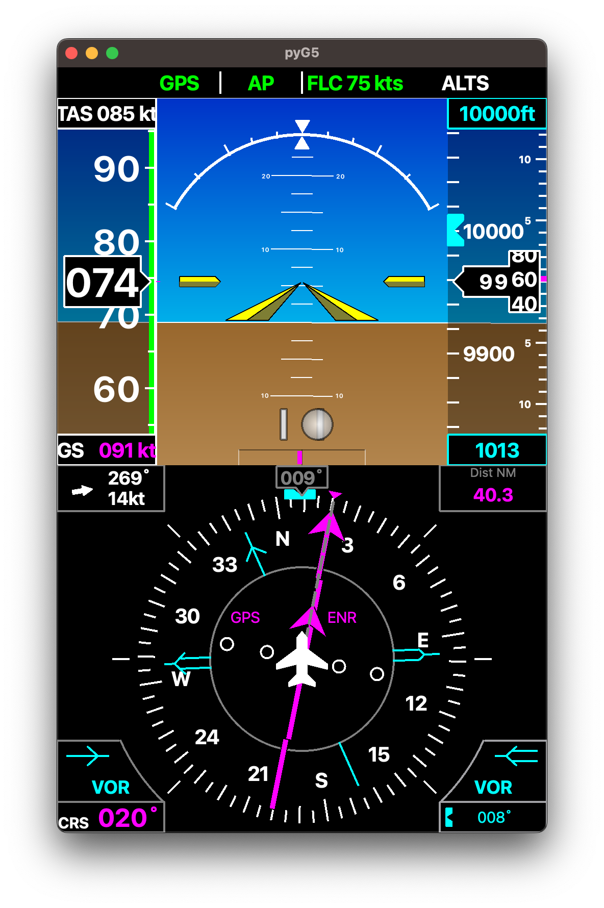

# PyG5

## Description

This project aims at development a Garmin G5 view targeting a Raspberry Pi 7 inches display (640x480) . The intent is to provide a G5 Attitude indicator + G5 Horizontal Situation Indicator stacked on the display in vertical mode. The `pyG5` connects to X-Plane flight simulator.

It does not require any plugin and use the standard DREF UDP interface from X-Plane. It should not require any configuration. Start it and
it will connect to X-Plane and fetch the required data.

This is currently developed on macOS with python 3.9 and testing on a RaspberryPi 4 with raspberypiOS and an official 7 inches display in vertical mode.



## Maturity

It's currently in pretty early phase. It's functional and should be easy to install but might suffer from issues here and  there.

Not all the features of the G5 are implemented. It's currently missing:

* Glide scope
* lateral guidance on the AI
* Distance to next way point on the Horizontal Situation Indicator.

## Installation

`pyG5` depends on PyQt5.

```console
        > sudo pip install pyG5
```

## Running

```console
        > pyG5DualStacked
```

Running on RaspberryPi it is recommended to install FreeSans fonts in order to be consistent with the rendering on the current main development platform, ie. macOS. Most liked this is solved with:

```console
        > sudo apt-get install libfreetype6
```

## Developers

If you intend to develop based on this project. At a glance:

* The application runs on PyQt5 event loop.
* It's loosely implementing a Model View Controller coding style
* The `pyG5Network` contains X-Plane network interface is monitoring the connection and feed data at 30Hz to a slot
* The view is repainting the interface every time the data is received from the network interface
* The `pyG5Widget` is derived twice into and Horizontal Situation Indicator and an AI. the `pyG5DualStack` instantiate both into a single widget. That means it's easy to build the view with just one of them.
* The `pyG5Main` module contains the application and the main window class.

## License

[License files](LICENSE.TXT)
